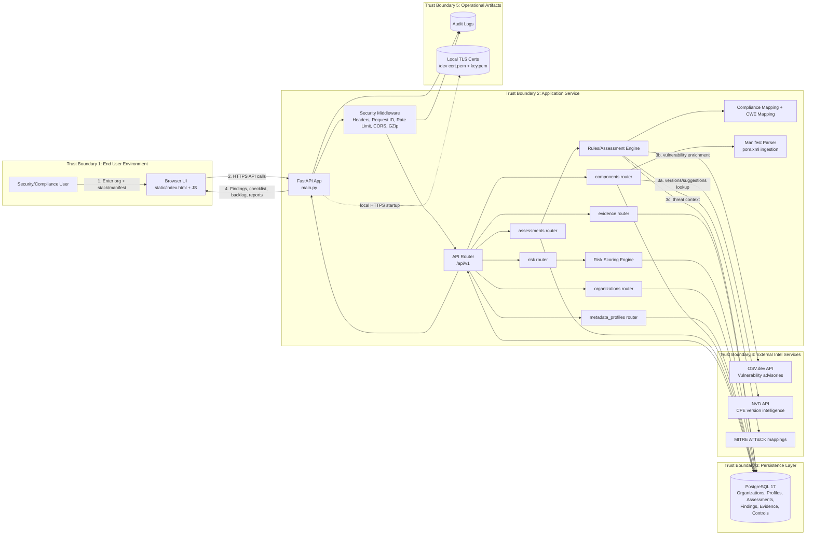

# Threat-Model Architecture Diagram

This diagram is designed for security review and threat modeling (DFD-style with trust boundaries).

## Full Solution Architecture (Threat Modeling View)



## STRIDE Threat Model (Per Diagram)

### Key Entry Points (from diagram)
* **TB1 → TB2:** Browser HTTPS API calls (label "2")
* **TB2 → TB3:** Data persistence (organizations, assessments, findings writes)
* **TB2 → TB4:** Outbound OSV.dev/NVD/MITRE queries (labels "3a", "3b", "3c")
* **TB2 → TB5:** Audit logging + TLS cert loading
* **TB3 ← → TB2:** Assessment/finding reads and writes

### Sensitive Assets
* Organization metadata (TB1 → TB2 → TB3)
* Software stack + manifest content (R_META, R_COMP, MP in TB2)
* Assessment findings + evidence (R_ASSESS, R_EVID writes to TB3)
* Audit logs (TB5)
* API keys (request auth)
* OSV.dev/NVD query results (TB4 ← TB2)

---

## 1. SPOOFING (Identity & Auth)

**Threat Actors:** Attackers claim to be legitimate users or internal services to bypass authentication.

### 1.1 API Caller Impersonation (TB1 → TB2 boundary)
**Attack:** Attacker sends requests without valid API key or forges authentication.

| Component | Current Risk | Mitigation |
|-----------|-------------|-----------|
| TB1 Browser sends HTTPS requests (label "2") | MEDIUM | HTTPS prevents tampering in transit |
| TB2 Middleware validates API keys | MEDIUM | Optional in dev; required in prod |
| All routers check `get_api_key_optional()` | MEDIUM | Config-driven; not database-backed |
| Rate limiting: 60 req/min per IP | **LOW** | Slows brute force |

**Recommended Hardening (⚠️ High):**
* Implement per-API-key rate limits (500 req/min per key)
* Move valid keys to database with versioning
* Hash stored keys; rotate every 30 days
* Log all auth attempts (success/failure)

---

### 1.2 Cross-Organization Access (TB2 ↔ TB3 boundary)
**Attack:** Attacker reads/modifies Organization A's assessments despite having no membership in Org A.

| Component | Current Risk | Mitigation |
|-----------|-------------|-----------|
| TB2 R_ORG routes accept `organization_id` as parameter | **CRITICAL** | No caller identity check; any org_id accepted |
| TB2 R_ASSESS, R_EVID filter by org_id | MEDIUM | SQL-level filtering works; but caller verification missing |
| TB3 Database has no row-level security (RLS) | **HIGH** | Database doesn't enforce org boundaries |
| No user authentication layer | **CRITICAL** | No way to associate caller with org membership |

**Recommended Hardening (⚠️ CRITICAL):**
* Implement user authentication (JWT or session tokens)
* Add `OrganizationMember` table with roles (admin, analyst, viewer)
* Verify caller's org membership before every org-scoped query:
```python
member = db.query(OrganizationMember).filter_by(
    organization_id=requested_org_id,
    user_id=current_user.id
).first()
if not member:
    raise 403 "Not authorized for this organization"
```
* Add database row-level security (PostgreSQL RLS) as defense-in-depth

---

## 2. TAMPERING (Integrity)

**Threat Actors:** Attackers modify data in flight, at rest, or during processing.

### 2.1 Manifest Input Tampering (TB1 → TB2, specifically MP - Manifest Parser)
**Attack:** Attacker modifies manifest content (pom.xml) to inject malicious component names or bypass filtering.

| Component | Current Risk | Mitigation |
|-----------|-------------|-----------|
| Browser uploads manifest to R_COMP router | MEDIUM | HTTPS protects transit |
| MP (Manifest Parser) in TB2 parses XML | **HIGH** | No content validation or checksums |
| No schema validation | **HIGH** | Accepts any well-formed XML |
| No integrity check stored | **HIGH** | Can't detect post-storage modifications |

**Recommended Hardening (⚠️ High):**
* Validate manifest content-type: `application/xml` or `text/xml` only
* Enforce manifest size limit: 5 MB max
* Store manifest SHA-256 hash in TB3 database
* Validate XML schema against whitelist of allowed elements
* Re-verify hash on retrieval to detect tampering

---

### 2.2 Finding/Evidence Modification (TB2 R_EVID ↔ TB3 boundary)
**Attack:** Attacker modifies assessments or findings after creation to hide vulnerabilities or cover tracks.

| Component | Current Risk | Mitigation |
|-----------|-------------|-----------|
| TB2 R_EVID PATCH endpoint allows updates | **HIGH** | Any authenticated caller can modify findings |
| TB3 Database stores findings in-place (no versions) | **HIGH** | No history of changes; modifications cover tracks |
| TB5 Audit logging captures action but not diffs | MEDIUM | Can't see what was changed |

**Recommended Hardening (⚠️ High):**
* Implement finding versioning (immutable storage):
  * Create new `FindingVersion` record on each update (don't modify original)
  * Mark old version as "superseded"
  * Store change summary + modifier identity
* Implement approval workflow for high-severity finding changes
* Require audit sign-off layer before findings marked "resolved"

---

### 2.3 Vulnerability API Cache Poisoning (TB2 ← → TB4 boundary)
**Attack:** Attacker intercepts or modifies OSV.dev/NVD responses before caching in TB2.

| Component | Current Risk | Mitigation |
|-----------|-------------|-----------|
| TB2 caches vulnerability responses in memory | **MEDIUM** | Cache not persisted; resets on restart |
| HTTPS validation on API calls | **LOW** | OSV.dev and NVD use TLS; requests library validates certs |
| Cache keyed by component name | **MEDIUM** | Attacker learns what's cached |
| No cache entry signature | **HIGH** | Can't detect tampering if cache compromised |

**Recommended Hardening:**
* Implement cache entry signing (HMAC over response data)
* Cache expiration: 24 hours (TTL)
* Monitor cache hit/miss ratio for anomalies

---

## 3. REPUDIATION (Accountability & Audit Trail)

**Threat Actors:** Attackers deny their actions or the system can't prove who did what.

### 3.1 Audit Log Gaps or Tampering (TB2 ↔ TB5 boundary)
**Attack:** Attacker performs action that goes unlogged, or deletes/modifies logs after the fact.

| Component | Current Risk | Mitigation |
|-----------|-------------|-----------|
| TB2 Middleware + all routers log to TB5 AUDIT | **LOW** | Good coverage of critical actions |
| Request IDs (from RequestIDMiddleware) enable correlation | **LOW** | Helps trace requests across logs |
| TB5 Audit logs stored in local file (audit.log) | **HIGH** | File system access can read/modify logs |
| No encryption on audit log file | **HIGH** | Plain-text content visible if compromised |
| No remote log shipping | **HIGH** | Logs not redundantly stored; single point of failure |

**Recommended Hardening (⚠️ High):**
* Ship logs to centralized SIEM immediately (Splunk, ELK, Datadog)
* Implement hash chain on audit records (each entry includes hash of previous)
* Encrypt audit logs at rest: AES-256-GCM
* Set file permissions: 600 (read-only to app user)
* Implement 90-day retention policy + archive older logs

---

### 3.2 Request Tracing Gaps (TB2 Middleware)
**Attack:** Attacker makes requests without identifiable correlation; audit log can't link events.

| Component | Current Risk | Mitigation |
|-----------|-------------|-----------|
| RequestIDMiddleware generates UUID per request | **LOW** | All requests traced |
| Request ID available to all route handlers | **LOW** | Included in logs |
| TB5 Audit logs include request ID | **LOW** | Full correlation chain present |

**Recommended Hardening:**
* Ensure request ID included in all structured log lines
* Continue propagating context for async tasks

---

## 4. INFORMATION DISCLOSURE (Confidentiality & Data Leakage)

**Threat Actors:** Attackers read data they shouldn't: org data, findings, metadata, audit logs, etc.

### 4.1 Cross-Organization Data Leakage (TB2 ↔ TB3 boundary)
**Attack:** Attacker reads findings, evidence, or profiles from other organizations.

| Component | Current Risk | Mitigation |
|-----------|-------------|-----------|
| TB2 routers filter queries by `organization_id` | MEDIUM | SQL filtering works if caller has legitimate org_id |
| TB3 Database has no row-level security | **HIGH** | DB doesn't enforce org boundaries |
| TB2 API routes accept `organization_id` parameter | **CRITICAL** | No verification caller can access that org (see Spoofing 1.2) |
| Audit logs capture org_id but not user identity | MEDIUM | Hard to attribute who accessed what |

**Recommended Hardening (⚠️ CRITICAL):**
* Implement user authentication + per-org membership checks (see Spoofing 1.2)
* Add database RLS: every query automatically filtered by `user_accessible_orgs`
* Implement per-role response filtering (admin sees all fields; analyst sees findings only; viewer sees read-only)

---

### 4.2 Error Message Information Leakage (TB2 Exception Handlers)
**Attack:** Attacker extracts system details (stack traces, schema info) from verbose error responses.

| Component | Current Risk | Mitigation |
|-----------|-------------|-----------|
| Production mode returns generic errors | **LOW** | Safe in production |
| Debug mode returns detailed errors | **LOW** | Only in development |
| Stack traces logged server-side, not returned | **LOW** | Good practice |
| Validation errors in dev expose schema hints | **MEDIUM** | Dev-only; low risk but worth hardening |

**Recommended Hardening:**
* Ensure `debug=false` and `APP_ENV=production` always in production
* Add startup check: warn if debug enabled in prod

---

### 4.3 OSV.dev/MITRE Data Leakage (TB2 ↔ TB4 boundary)
**Attack:** Attacker learns what components/vulnerabilities are cached by timing analysis or unintended responses.

| Component | Current Risk | Mitigation |
|-----------|-------------|-----------|
| TB2 caches vulnerability responses in memory | **MEDIUM** | Cache keys leaked if process memory readable |
| Cache keyed by component name | **MEDIUM** | Attacker learns what's being assessed |
| No cache access control | **MEDIUM** | Any process thread can read cache |

**Recommended Hardening:**
* Encrypt sensitive cache entries (AES-256)
* Implement cache entry time-to-live (TTL): 24 hours
* Monitor cache usage for anomalies
* Don't expose cache stats in debug endpoints

---

### 4.4 Audit Log Exposure (TB5 Storage)
**Attack:** Attacker reads audit logs to learn about other orgs' vulnerabilities or activities.

| Component | Current Risk | Mitigation |
|-----------|-------------|-----------|
| TB5 Audit logs stored in local file | **HIGH** | File system access can read logs |
| No access control on audit.log | **HIGH** | Process owner + others can read |
| No encryption | **HIGH** | Plain-text if store accessed |
| Logs not archived securely | **HIGH** | No separation between current + historical logs |

**Recommended Hardening (⚠️ High):**
* Encrypt logs at rest: AES-256-GCM
* Ship to remote SIEM immediately
* Set file permissions: 600 (read-only to app user)
* Implement retention: 90 days current + archived securely
* Separate audit database credentials from app credentials

---

## 5. DENIAL OF SERVICE (Availability)

**Threat Actors:** Attackers make the system unavailable through resource exhaustion or dependency failures.

### 5.1 Rate Limit Bypass (TB2 Middleware)
**Attack:** Attacker circumvents rate limits to perform brute force, resource exhaustion, or scanning.

| Component | Current Risk | Mitigation |
|-----------|-------------|-----------|
| Global rate limit: 60 req/min per IP (Middleware) | **MEDIUM** | In-memory; resets on restart |
| No per-endpoint customization | **MEDIUM** | R_ASSESS expensive; R_COMP cheap (same limit) |
| No per-API-key limits | **HIGH** | Only IP-based; VPN users share limits |
| No adaptive rate limiting | **MEDIUM** | No escalation on repeated violations |

**Recommended Hardening (⚠️ High):**
* Switch to Redis-backed rate limiting (survives restarts)
* Implement per-endpoint limits:
  * R_COMP (cheap): 300/min
  * R_ASSESS (expensive): 5/min
  * R_ORG (moderate): 100/min
* Add per-API-key limits: 500/min
* Implement adaptive rate limiting: tighter on repeated 429 responses

---

### 5.2 OSV.dev API Dependency Failure (TB2 ↔ TB4 boundary)
**Attack:** OSV.dev becomes unavailable; system can't fetch vulnerabilities, blocking assessments.

| Component | Current Risk | Mitigation |
|-----------|-------------|-----------|
| TB2 Assessment routers call OSV.dev directly | **MEDIUM** | OSV service has retry with backoff (max 3 attempts) |
| 30 second timeout on OSV.dev requests | **LOW** | Implemented in OSVService._request() |
| No cached fallback data | **HIGH** | No vulnerabilities returned if OSV.dev down |
| No circuit breaker pattern | **HIGH** | Cascading failures on repeated OSV.dev outages |

**Recommended Hardening:**
* Cache OSV.dev responses with TTL: 24 hours
* Implement circuit breaker:
  * After 5 failed OSV.dev calls in 1 minute → return cached data
  * Prevent cascading failures
* Return response: "Vulnerability data temporarily unavailable; using cached data"

---

### 5.3 Expensive Assessment Computation (TB2 R_ASSESS ↔ RE engine)
**Attack:** Attacker triggers expensive correlation + risk scoring repeatedly, consuming CPU.

| Component | Current Risk | Mitigation |
|-----------|-------------|-----------|
| TB2 R_ASSESS synchronously runs RE (Rules Engine) + CE + RS | **MEDIUM** | Expensive computation; ties up worker |
| No job queue or async processing | **HIGH** | Blocking request; no horizontal scaling |
| No result caching | **HIGH** | Same assessment run twice = wasted work |
| No timeout on engine execution | **HIGH** | Runaway computation can hang worker indefinitely |

**Recommended Hardening (⚠️ High):**
* Implement async job queue (Celery + Redis):
  * POST `/assessments` returns job_id immediately (202 Accepted)
  * Client polls GET `/assessments/{job_id}` for status/results
  * Job runs in background worker
* Cache assessment results: 1 hour (if metadata unchanged)
* Add timeout to correlation engine: 30 seconds max
* Implement job priorities (user-initiated = high; batch = low)

---

### 5.4 Large Manifest Parsing (TB1 → TB2 MP component)
**Attack:** Attacker uploads huge manifest (10+ MB pom.xml) to exhaust memory/CPU.

| Component | Current Risk | Mitigation |
|-----------|-------------|-----------|
| TB1 Browser uploads manifest to TB2 R_COMP | **MEDIUM** | No size limit enforced |
| TB2 MP (Manifest Parser) parses entire file into memory | **HIGH** | Large files = memory spike + slow parse |
| No streaming parser (loads all into memory) | **HIGH** | DoS via memory exhaustion |
| No parsing timeout | **MEDIUM** | Runaway parser can hang worker |

**Recommended Hardening:**
* Enforce manifest size limit: 5 MB max
* Return 413 Payload Too Large if exceeded
* Implement streaming XML parser (lxml iterparse)
* Add parsing timeout: 10 seconds

---

### 5.5 Database Connection Exhaustion (TB2 ↔ TB3 boundary)
**Attack:** Attacker opens many concurrent requests, exhausting DB connection pool.

| Component | Current Risk | Mitigation |
|-----------|-------------|-----------|
| SQLAlchemy connection pool (default: 10 connections) | **MEDIUM** | Small pool; easy to exhaust |
| No connection pool monitoring | **HIGH** | No visibility into pool usage |
| DB queries may run long (TB2 correlation engine) | **MEDIUM** | Holds connection while processing |

**Recommended Hardening:**
* Configure pool with overflow: `pool_size=20, max_overflow=40` (total 60)
* Add connection pool monitoring: log checkedout; alert > 80% utilized
* Implement per-query timeout: 30 seconds
* Current `pool_pre_ping=True` helps (already enabled)

---

## 6. ELEVATION OF PRIVILEGE (Authorization & Access Control)

**Threat Actors:** Attackers gain access or permissions they shouldn't have.

### 6.1 Organization Access Bypass (TB2 ↔ TB3, all routers)
**Attack:** Attacker accesses Organization A's assessments despite no membership in Org A.

| Component | Current Risk | Mitigation |
|-----------|-------------|-----------|
| TB2 routers (R_ORG, R_ASSESS, R_EVID) accept org_id parameter | **CRITICAL** | No verification caller can access org |
| No user authentication layer | **CRITICAL** | Can't associate caller with org membership |
| TB3 Database has no RLS | **CRITICAL** | DB doesn't enforce boundaries |

**Recommended Hardening (⚠️ CRITICAL):**
* See **Spoofing 1.2** and **Information Disclosure 4.1** for full mitigation

---

### 6.2 API Key Privilege Escalation (TB1 → TB2, all routes)
**Attack:** Attacker uses API key to modify/delete data despite having only read access.

| Component | Current Risk | Mitigation |
|-----------|-------------|-----------|
| All API keys equivalent; same access level | **HIGH** | No fine-grained permissions |
| No key scoping (read-only, write, admin) | **HIGH** | Key compromise = full access |
| No per-org key binding | **HIGH** | Single key accesses all orgs |
| DELETE endpoints not restricted | **HIGH** | Dangerous operations allowed freely |

**Recommended Hardening (⚠️ High):**
* Implement API key scopes:
  * `read`: GET only
  * `write`: GET + POST + PATCH
  * `admin`: GET + POST + PATCH + DELETE (rare)
* Implement per-org key binding:
  * Key can only access Organization X
  * Requesting Org Y → 403 "Key not authorized"
* Implement key expiration + auto-rotation

---

### 6.3 Middleware Bypass (TB2 Middleware stack)
**Attack:** Attacker bypasses security headers, rate limiting, or request tracking.

| Component | Current Risk | Mitigation |
|-----------|-------------|-----------|
| Middleware stack properly layered (SecurityHeaders → RequestID → ResponseTime) | **LOW** | Good architecture |
| CORS restricted to explicit TLS origins (no wildcard) | **LOW** | TLS-only origins in dev and prod |
| All routes go through middleware | **LOW** | No bypass paths |

**Recommended Hardening:**
* Ensure `CORS_ORIGINS` explicitly set in production (whitelist)
* Add startup validation: verify middleware applied to all routes
* Test middleware enforcement with security scanning

---

## AI-Generated STRIDE Findings (2026-03-16)

The following 12 threats were identified by running Charlotte's Web against its own stack (27 findings, 16 components, model: claude-sonnet-4-6). They supplement the manual STRIDE analysis in sections 1-6.

| ID | Severity | Category | Threat | Status |
|----|----------|----------|--------|--------|
| S-AI.1 | CRITICAL | Tampering | HTTP traffic without mandatory TLS allows interception/modification of requests, tokens, and payloads | **Mitigated** (HTTPSEnforcementMiddleware + HSTS + port 8443 TLS) |
| S-AI.2 | HIGH | Spoofing | JWT crit header bypass (PyJWT) allows forged tokens with weak algorithms | **Mitigated** (PyJWT 2.12.1 installed, strict HS256 pinning, 60-min expiry) |
| S-AI.3 | HIGH | Spoofing | Absent MFA means stolen credentials yield full account access | **Planned** (TOTP via pyotp) |
| S-AI.4 | HIGH | Tampering | Database without encryption at rest; host compromise = full data access | **Partial** PostgreSQL with scram-sha-256 auth; encryption at rest via OS-level disk encryption |
| S-AI.5 | HIGH | DoS | SlowAPI is sole DoS control; no upstream proxy to enforce connection-level limits | **Partial** (rate limiting exists, no reverse proxy) |
| S-AI.6 | HIGH | DoS | python-multipart ReDoS can stall the async event loop | **Mitigated** (python-multipart 0.0.22 patches ReDoS; CVE-2024-24762/CVE-2024-53981) |
| S-AI.7 | HIGH | Elevation | Single database role with full privileges; leaked connection string = full table access | **Partial** PostgreSQL with scram-sha-256 auth; least-privilege roles planned |
| S-AI.8 | HIGH | Elevation | FastAPI CSRF (CVE-2021-32677) on cookie-authenticated endpoints | **Mitigated** (FastAPI 0.135.1 includes fix from 0.65.2+; API uses Bearer tokens, not cookies) |
| S-AI.9 | MEDIUM | Repudiation | Insufficient audit logging prevents forensic investigation | **Partial** (JSON structured audit logging exists with request correlation, API key masking; needs SIEM + append-only sink) |
| S-AI.10 | MEDIUM | Info Disclosure | requests library may leak Proxy-Authorization headers on redirects | **Mitigated** (requests 2.32.5 includes fix; verify=True never overridden) |
| S-AI.11 | MEDIUM | Info Disclosure | Verbose error responses may leak stack traces or SQL fragments | **Mitigated** (global exception handler returns generic 500; debug=False in production) |
| S-AI.12 | MEDIUM | Elevation | Alembic migrations run with same DB connection as app; no review gate | **Open** Needs dedicated DDL-only DB user and CI-only execution |

---

## AI-Generated Remediation Roadmap (2026-03-16)

Priority-ordered remediation steps from the AI threat model analysis (27 findings, 16 components):

| Step | Action | Rationale | Status |
|------|--------|-----------|--------|
| 1 | **Enable TLS 1.2+ on all endpoints:** deploy nginx/Caddy as TLS-terminating reverse proxy. Enforce HTTPS-only with HSTS. Disable direct Uvicorn internet exposure. | Missing TLS exposes all data to interception. Direct HIPAA 164.312(e)(1) violation. All other controls undermined without encrypted transport. | **Mitigated** (HTTPSEnforcementMiddleware + HSTS + port 8443 TLS binding) |
| 2 | **Verify and pin python-multipart 0.0.22** with hash pinning. Confirm UPLOAD_KEEP_FILENAME is False. Deploy nginx client_max_body_size and timeout limits upstream of Uvicorn. | Path traversal (CVE-2026-24486, CRITICAL) + ReDoS create unauthenticated attack surface. Path traversal can lead to RCE. | **Mitigated** (0.0.22 installed; no file upload endpoints exist) |
| 3 | **Implement mandatory MFA (TOTP via pyotp)** for all user accounts. Two-step login: password verification issues pre-auth token; TOTP exchanges for full session JWT. | Single-factor auth is next most likely attack vector after transport. HIPAA 164.312(a)(1) gap. | **Planned** |
| 4 | **Implement structured audit logging middleware** that records all authentication events, endpoint access, and error conditions to an append-only log sink. Configure 180-day minimum retention. | Without audit logs, cannot detect attacks, perform forensics, or demonstrate HIPAA 164.312(b) compliance. | **Partial** (JSON structured logging exists with request correlation and key masking; needs SIEM + append-only sink) |
| 5 | **Configure PostgreSQL role-based access control** separating DDL user from DML user. Enable encryption at rest via OS-level disk encryption or cloud-managed encrypted volumes. | Database accessible to any user with the connection string. HIPAA 164.312(a)(2)(iv). | **Partial** PostgreSQL with scram-sha-256 auth deployed; least-privilege roles planned |
| 6 | **Rotate JWT signing secrets.** Assert minimum 32-byte secret at startup. Set 15-minute token expiry with refresh rotation. Pin algorithms=['HS256'] in all decode calls. | Weak JWT secrets combined with crit-header bypass represent spoofing risk. | **Partial** (strict HS256 + 60-min expiry enforced; needs key length assertion + refresh rotation) |
| 7 | **Document formal HIPAA Risk Analysis** covering: asset inventory, threat identification, vulnerability assessment, impact/likelihood analysis, risk determination. Use this threat model as input artifact. | HIPAA 164.308(a)(1)(ii)(A) foundational requirement. Regulators treat absence as systemic compliance failure. | **Planned** |

---

## Self-Assessment Summary

Sections 7-10 were added after running Charlotte's Web against itself, using the platform's own threat modeling feature to analyze its own dependency stack. Updated 2026-03-16 using OSV.dev cross-ecosystem vulnerability scanning (replaced NVD keyword matching which produced false positives). AI-generated findings were verified against the actual codebase to correct assumptions about absent controls that are in fact implemented (TLS, audit logging, error handling, CORS, algorithm validation).

**AI Threat Model Summary (2026-03-16):** 27 findings analyzed across 16 components, 12 STRIDE threats identified (1 CRITICAL, 7 HIGH, 3 MEDIUM), 6 components with known CVEs. Risk is both architectural/configuration and dependency driven. After verification against the actual codebase, several AI-reported gaps were found to be already mitigated (TLS enforcement, audit logging, error handling, CORS, PyJWT crit header, FastAPI CSRF, python-multipart ReDoS, requests redirect leaks). See the AI-Generated STRIDE Findings and Remediation Roadmap sections above for the corrected analysis.

| Disposition | Count | Description |
|-------------|-------|-------------|
| **Mitigated** | 6 | TLS enforcement + HSTS, python-multipart ReDoS (0.0.22), PyJWT crit header (2.12.1), FastAPI CSRF (0.135.1), requests redirect leak (2.32.5), error handling (no stack traces in prod) |
| **Partially Mitigated** | 2 | Audit logging (JSON structured logging exists, needs SIEM + append-only sink), rate limiting (60/min per IP, needs reverse proxy + per-endpoint tuning) |
| **Partially Mitigated** | 2 | PostgreSQL encryption at rest (OS-level), PostgreSQL RBAC (least-privilege roles planned) |
| **Open** | 1 | Alembic migrations need dedicated DDL-only DB user and CI-only execution |
| **Remediation Planned** | 3 | MFA (pyotp), passlib to argon2-cffi migration, HIPAA risk analysis documentation |

---

## 7. Dependency Vulnerabilities (Supply Chain)

**Threat Actors:** Attackers exploit known CVEs in third-party dependencies to compromise the application.

### 7.1 Known CVEs in Dependencies (TB2 Application Service)
**Attack:** Attacker exploits publicly disclosed vulnerabilities in installed packages.

**OSV.dev Scan Results (2026-03-16):** 6 components with known CVEs across 16 components (14 PyPI packages + Python 3.14.3 + PostgreSQL 17.9). Cross-ecosystem scanning via OSV.dev surfaces advisories from Debian, Ubuntu, openSUSE, and GHSA databases. Several findings are scanner false positives (version already patched) or namespace confusion (npm vs PyPI).

| Component | Version | CVEs | Severity | Status |
|-----------|---------|------|----------|--------|
| sqlalchemy | 2.0.48 | UBUNTU-CVE-2019-7164, UBUNTU-CVE-2019-7548 | LOW | **False positive** (CVEs affect 1.2.x/1.3.x, not 2.0.x; suppress with justification) |
| python-multipart | 0.0.22 | DEBIAN-CVE-2024-24762, DEBIAN-CVE-2024-53981, DEBIAN-CVE-2026-24486, UBUNTU-CVE-2026-24486, openSUSE-SU-2026:10333-1 | HIGH | **Mitigated** (0.0.22 patches path traversal + ReDoS; confirm PyPI build, not distro repackage) |
| pyjwt | 2.12.1 | DEBIAN-CVE-2025-45768, DEBIAN-CVE-2026-32597, UBUNTU-CVE-2026-32597, UBUNTU-CVE-2025-45768, MAL-2025-48036 | HIGH | **Mitigated** (2.12.1 includes crit header fix; MAL-2025-48036 is npm namespace, not PyPI) |
| fastapi | 0.135.1 | DEBIAN-CVE-2021-32677, UBUNTU-CVE-2021-32677, UBUNTU-CVE-2024-40627 | MEDIUM | **Mitigated** (0.135.1 is above 0.65.2 fix; CVE-2024-40627 is fastapi-opa, not core FastAPI) |
| requests | 2.32.5 | DEBIAN-CVE-2023-32681, DEBIAN-CVE-2024-35195, DEBIAN-CVE-2024-47081, UBUNTU-CVE-2024-35195 | MEDIUM | **Mitigated** (2.32.5 includes all fixes; verify=True never overridden) |
| uvicorn | 0.41.0 | MAL-2025-4901 | LOW | **False positive** (MAL references npm package, not PyPI uvicorn; pin hashes in requirements.txt) |

**Previous NVD keyword search results (now deprecated):** Earlier scans using NVD keyword matching flagged 11 CVEs, of which 7 were false positives due to incorrect package attribution. The migration to OSV.dev cross-ecosystem scanning surfaces real advisories but also includes cross-distribution and namespace-squatting findings that require triage.

### 7.2 Maintenance and Monitoring Notes

| Component | Version | Risk | Action |
|-----------|---------|------|--------|
| passlib | 1.7.4 | **Maintenance risk** | Minimally maintained project. Migrate password hashing to argon2-cffi (Argon2id algorithm, OWASP recommended). Passlib can wrap argon2-cffi as a transitional step. |
| PostgreSQL | 17.9 | **Monitor** | Current version. Monitor for upstream CVEs. Ensure scram-sha-256 authentication is enforced. |
| python-multipart | 0.0.22 | **Monitor** | No known CVEs at this version. Previous versions (0.0.5-0.0.6) had critical ReDoS vulnerabilities. Ensure input validation is enforced at the application layer. |

**Recommended cadence:** Weekly `pip-audit` or Dependabot scanning. Pin all dependencies with exact versions and validate hashes.

---

## 8. Data Protection Gaps

### 8.1 Data at Rest: PostgreSQL Database Encryption (TB3 Persistence Layer)
**Attack:** Attacker with host access reads database contents without application credentials.

| Component | Current Risk | Mitigation |
|-----------|-------------|-----------|
| PostgreSQL data directory on local filesystem | **MEDIUM** | scram-sha-256 auth required, localhost only |
| Database contains all org data, assessments, findings | **MEDIUM** | Auth prevents unauthenticated access |
| No transparent data encryption configured | **MEDIUM** | Relies on OS-level disk encryption |

**Current Disposition:** Partially mitigated. PostgreSQL requires password authentication (scram-sha-256). Database is localhost only.

**Recommended Hardening:**
* Enable FileVault (macOS) or equivalent full-disk encryption
* Production: Use cloud-managed encrypted storage (AWS RDS encryption, Azure TDE)
* Implement least-privilege PostgreSQL roles (separate DDL and DML users)

### 8.2 Data in Transit: TLS Enforcement (TB1 ↔ TB2 boundary)
**Status: Mitigated**

| Component | Current Risk | Mitigation |
|-----------|-------------|-----------|
| `HTTPSEnforcementMiddleware` redirects HTTP → HTTPS (301) | **LOW** | All requests forced to TLS |
| HSTS header: `max-age=31536000; includeSubDomains; preload` | **LOW** | Browsers enforce HTTPS on return visits |
| Dev server binds exclusively on port 8443 with TLS certificates | **LOW** | No plaintext listener available |

---

## 9. Authentication Gaps

### 9.1 Absent Multi-Factor Authentication (TB1 → TB2 boundary)
**Attack:** Credential stuffing or phishing against single-factor authentication provides full account takeover.

| Component | Current Risk | Mitigation |
|-----------|-------------|-----------|
| Authentication relies on API keys and JWT tokens only | **HIGH** | No second factor |
| JWT compromise = full access (no MFA challenge) | **HIGH** | Single point of failure |

**Current Disposition:** Remediation planned. TOTP-based MFA (e.g., `pyotp`) is planned for a future release when user login flows are added.

---

## 10. Compliance Determination

### 10.1 HIPAA: Not Applicable
This application processes software component metadata and vulnerability data. It does not store, transmit, or process Protected Health Information (PHI). HIPAA requirements do not apply.

If the application scope changes to include PHI, a full HIPAA gap analysis must be conducted before deployment.

### 10.2 SSRF Risk (TB2 → TB4 boundary)
**Attack:** If user-controlled URLs are passed to python-requests, an attacker could pivot to internal network resources or cloud metadata endpoints.

| Component | Current Risk | Mitigation |
|-----------|-------------|-----------|
| python requests makes outbound calls to OSV.dev and NVD APIs | **LOW** | Base URLs are hardcoded, not user supplied |
| No user-supplied URL input currently exists | **LOW** | No SSRF vector present |

**Current Disposition:** Accepted risk. URL allowlisting recommended if user-controlled URLs are added in the future.

---

## Summary: Prioritized Mitigations

| Priority | Threat | Mitigation | Trust Boundary | Status |
|----------|--------|-----------|-----------------|--------|
| **CRITICAL** | Spoofing 1.2, Elevation 6.1 | User auth + org membership checks | TB1 ↔ TB2 ↔ TB3 | Open |
| **CRITICAL** | Information Disclosure 4.1 | Row-level security + caller auth | TB2 ↔ TB3 | Open |
| ⚠️ **HIGH** | Data at Rest 8.1 | PostgreSQL encryption at rest + RBAC | TB3 | Partial (scram-sha-256 auth, needs RBAC) |
| ⚠️ **HIGH** | Authentication 9.1 | MFA implementation (pyotp/TOTP) | TB1 → TB2 | Planned |
| ⚠️ **HIGH** | Tampering 2.2 | Finding audit trail + versioning | TB2 ↔ TB3 | Open |
| ⚠️ **HIGH** | Repudiation 3.1 | SIEM + log encryption + hash chain | TB2 ↔ TB5 | Partial (logging exists, needs SIEM) |
| ⚠️ **HIGH** | DoS 5.1 | Redis rate limiting + per-endpoint tuning | TB2 Middleware | Partial (60/min per IP exists) |
| ⚠️ **HIGH** | DoS 5.2 | OSV.dev circuit breaker + caching + timeout | TB2 ↔ TB4 | Partial (retry + 30s timeout exists) |
| ⚠️ **HIGH** | DoS 5.3 | Async job queue (Celery) | TB2 R_ASSESS | Open |
| ⚠️ **HIGH** | Elevation 6.2 | API key scopes + per-org binding | TB1 → TB2 | Open |
| **MEDIUM** | Secret Exposure S-AI.2 | SecretStr + secrets manager | TB2 Config | Partial (key masking exists) |
| **MEDIUM** | JWT Key Weakness S-AI.3 | 512-bit secret + refresh rotation | TB2 Auth | Partial (strict algo + expiry exists) |
| **MEDIUM** | Alembic Integrity S-AI.4 | Signed commits + CI-only migrations | TB2 Deploy | Open |
| **MITIGATED** | Database Contention S-AI.5 | PostgreSQL connection pooling | TB3 | Mitigated |
| **LOW** | File Upload S-AI.6 | Implement scaffolded controls when enabled | TB2 R_COMP | N/A (no upload endpoints) |
| **MITIGATED** | Data in Transit 8.2 | TLS enforcement + HSTS + port 8443 | TB1 ↔ TB2 | Mitigated |
| **MITIGATED** | Error Handling 4.2 | Debug disabled in prod, generic errors | TB2 | Mitigated |
| **MITIGATED** | CORS 6.3 | Strict whitelist, no wildcard, TLS-only origins | TB2 Middleware | Mitigated |
| **MITIGATED** | Request Tracing 3.2 | UUID per request, X-Request-ID header | TB2 Middleware | Mitigated |
| **TRIAGED** | Supply Chain 7.1 | 6 components with CVEs (4 mitigated/false positive, 2 monitor) | TB2 | Mitigated (see 7.1 table) |

---

## Threat Model Review Cadence

* **Monthly:** Review critical/high-priority mitigations for completeness
* **Quarterly:** Full threat model refresh (new features, architecture changes)
* **Post-Incident:** Immediate update if any issue exploits a gap
* **Last Review:** 2026-03-16 (self-assessment using Charlotte's Web threat modeling feature, 27 findings across 16 components)

## ASCII Diagram Fallback

Use this if your Markdown viewer cannot render Mermaid.

[User]
    |
    v
[Browser UI: static/index.html + JS]
    |
    | HTTPS requests
    v
[FastAPI App: main.py]
    |
    +--> [Middleware: Security headers, request-id, rate-limit, CORS, gzip]
    |
    v
[API Router /api/v1]
    |
    +--> organizations
    +--> metadata_profiles
    +--> components --> [Manifest Parser] --> [NVD CPE]
    +--> assessments --> [Rules Engine] --> [Compliance/CWE Mapping]
    |                    |                    |
    |                    +--> [OSV.dev]       +--> [MITRE]
    |                    +--> [Findings/Assessment writes]
    +--> evidence
    +--> risk --> [Risk Scoring Engine]
    |
    v
[Database: orgs, profiles, assessments, findings, evidence, controls]

[Audit Logs] <- App + middleware events
[Dev TLS certs] <- local HTTPS startup path

## Detailed DFD: Assessment Execution Workflow

Use this when you want to threat model a single high-value path in depth.

```mermaid
flowchart TD
    %% External Actor
    A[Analyst/User]

    %% Trust Boundary: Browser
    subgraph B1[Boundary: Browser]
        UI[Web UI\nCollect org + stack]
    end

    %% Trust Boundary: API Service
    subgraph B2[Boundary: FastAPI Service]
        EP1[POST /organizations]
        EP2[POST /metadata-profiles]
        EP3[POST /assessments]
        EP4[POST analyze-nvd]
        EP5[GET findings]

        VAL[Validation + auth/rate-limit middleware]
        RULES[Rules engine + control mapping]
        CORR[Correlation logic\ncomponent version to CVE/CWE/control]
        SCORE[Risk prioritization\n(priority window/severity)]
        AUD[Audit logger]
    end

    %% Trust Boundary: Data Store
    subgraph B3[Boundary: Database]
        ORGT[(Organizations)]
        PROFT[(MetadataProfiles)]
        ASST[(Assessments)]
        FINDT[(Findings)]
        CTRLT[(Controls)]
    end

    %% Trust Boundary: External Intel
    subgraph B4[Boundary: External Threat Intel]
        OSV2[OSV.dev API]
        NVD2[NVD CPE API]
        MITRE2[MITRE mapping data]
    end

    %% User flow
    A --> UI
    UI --> EP1
    UI --> EP2
    UI --> EP3
    UI --> EP4
    UI --> EP5

    %% API internals
    EP1 --> VAL
    EP2 --> VAL
    EP3 --> VAL
    EP4 --> VAL
    EP5 --> VAL

    VAL --> ORGT
    VAL --> PROFT
    VAL --> ASST

    EP4 --> RULES
    RULES --> CTRLT
    EP4 --> CORR
    CORR --> OSV2
    CORR --> MITRE2
    CORR --> SCORE
    SCORE --> FINDT
    SCORE --> ASST

    %% Audit everywhere
    EP1 --> AUD
    EP2 --> AUD
    EP3 --> AUD
    EP4 --> AUD
    EP5 --> AUD

    %% Response
    FINDT --> EP5
    EP5 --> UI
```

### Threat-Model Prompts for This DFD

* Input validation: How is malformed stack/manifest input rejected before correlation logic?
* External dependency trust: What happens if OSV.dev is unavailable or returns partial data?
* Authorization scope: Can one org read another org's assessments/findings?
* Integrity: How do we prevent tampering of assessment/finding records between creation and display?
* DoS controls: Which endpoints are rate-limited and where are expensive calls cached?

## AI-Generated Data Flow Diagram (2026-03-16)

Simplified DFD generated by the AI threat model analysis (27 findings, 16 components, claude-sonnet-4-6), focused on component-level data flows and security boundaries.

```mermaid
graph LR
    subgraph End User Environment
        end_user(("End User (Browser / API Client)"))
    end
    subgraph Application Tier
        fastapi_app["FastAPI Application (Uvicorn)"]
        slowapi["SlowAPI Rate Limiter (Middleware)"]
        jwt_auth["JWT Auth Middleware (PyJWT)"]
        multipart["Multipart File Parser (python-multipart)"]
        alembic["Alembic Migration Runner"]
    end
    subgraph Data Layer
        postgres_db[("PostgreSQL 17 (SQLAlchemy ORM)")]
    end
    subgraph External Services
        anthropic_api{"Anthropic Claude API"}
    end
    end_user -->|HTTPS (TLS 1.2+) REST API requests| fastapi_app
    end_user -->|HTTPS credentials (login/JWT)| fastapi_app
    fastapi_app -->|Internal middleware chain| slowapi
    fastapi_app -->|Internal middleware chain Bearer token| jwt_auth
    fastapi_app -->|Internal multipart form/file data| multipart
    fastapi_app -->|SQLAlchemy ORM SQL via psycopg2| postgres_db
    alembic -->|DDL migrations SQL| postgres_db
    fastapi_app -->|HTTPS REST prompt and response data| anthropic_api
```
