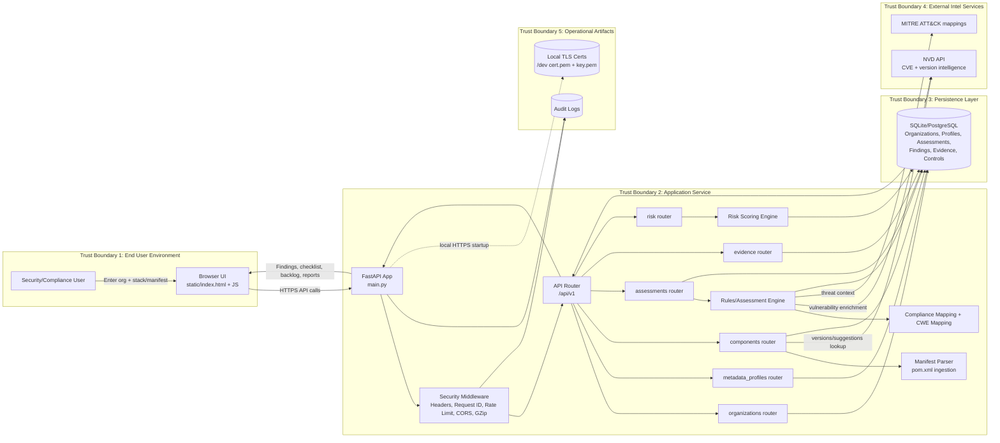

# Architecture Diagram (Viewer-Safe)

If your Markdown viewer fails to render Mermaid, use the ASCII diagram below.

## Mermaid Diagram

## ASCII Fallback (Always Visible)

[User]
   |
   v
[Browser UI: static/index.html + JS]
   |
   | HTTPS requests
   v
[FastAPI App: main.py]
   |
   +--> [Middleware: Security headers, request-id, rate-limit, CORS, gzip]
   |
   v
[API Router /api/v1]
   |
   +--> organizations
   +--> metadata_profiles
   +--> components --> [Manifest Parser] --> [NVD]
   +--> assessments --> [Rules Engine] --> [Compliance/CWE Mapping]
   |                    |                    |
   |                    +--> [NVD]           +--> [MITRE]
   |                    +--> [Findings/Assessment writes]
   +--> evidence
   +--> risk --> [Risk Scoring Engine]
   |
   v
[Database: orgs, profiles, assessments, findings, evidence, controls]

[Audit Logs] <- App + middleware events
[Dev TLS certs] <- local HTTPS startup path
