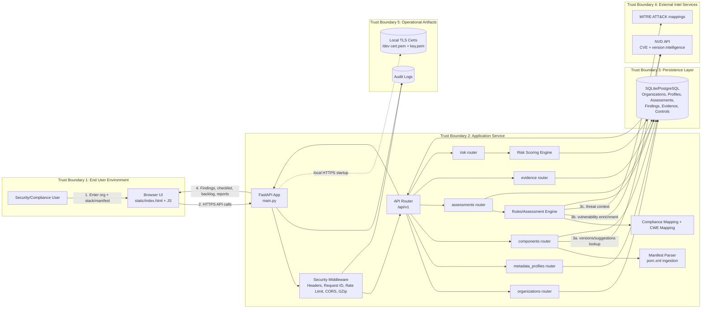

# Threat-Model Architecture Diagram

This diagram is designed for security review and threat modeling (DFD-style with trust boundaries).

## Full Solution Architecture (Threat Modeling View)



## How to Use This in Threat Modeling

- Entry points: Browser form inputs, manifest upload/paste, all /api/v1 endpoints.
- Sensitive assets: organization metadata, software stack, findings, evidence, audit logs, API keys.
- External dependencies: NVD and MITRE availability/integrity affect analysis quality.
- Highest-risk boundaries: Browser ↔ API, API ↔ DB, API ↔ external intelligence providers.

## Suggested STRIDE Focus Areas

- Spoofing: API auth/session boundaries, org-scoped access checks.
- Tampering: manifest input handling, finding/evidence update endpoints.
- Repudiation: request IDs + audit log completeness.
- Information disclosure: metadata leakage across orgs, error-message exposure.
- Denial of service: NVD-dependent routes, expensive assessment/risk endpoints.
- Elevation of privilege: object-level authorization for org/profile/assessment access.

## Detailed DFD: Assessment Execution Workflow

Use this when you want to threat model a single high-value path in depth.

```mermaid
flowchart TD
    %% External Actor
    A[Analyst/User]

    %% Trust Boundary: Browser
    subgraph B1[Boundary: Browser]
        UI[Web UI\nCollect org + stack]
    end

    %% Trust Boundary: API Service
    subgraph B2[Boundary: FastAPI Service]
        EP1[POST /organizations]
        EP2[POST /metadata-profiles]
        EP3[POST /assessments]
        EP4[POST analyze-nvd]
        EP5[GET findings]

        VAL[Validation + auth/rate-limit middleware]
        RULES[Rules engine + control mapping]
        CORR[Correlation logic\ncomponent version to CVE/CWE/control]
        SCORE[Risk prioritization\n(priority window/severity)]
        AUD[Audit logger]
    end

    %% Trust Boundary: Data Store
    subgraph B3[Boundary: Database]
        ORGT[(Organizations)]
        PROFT[(MetadataProfiles)]
        ASST[(Assessments)]
        FINDT[(Findings)]
        CTRLT[(Controls)]
    end

    %% Trust Boundary: External Intel
    subgraph B4[Boundary: External Threat Intel]
        NVD2[NVD API]
        MITRE2[MITRE mapping data]
    end

    %% User flow
    A --> UI
    UI --> EP1
    UI --> EP2
    UI --> EP3
    UI --> EP4
    UI --> EP5

    %% API internals
    EP1 --> VAL
    EP2 --> VAL
    EP3 --> VAL
    EP4 --> VAL
    EP5 --> VAL

    VAL --> ORGT
    VAL --> PROFT
    VAL --> ASST

    EP4 --> RULES
    RULES --> CTRLT
    EP4 --> CORR
    CORR --> NVD2
    CORR --> MITRE2
    CORR --> SCORE
    SCORE --> FINDT
    SCORE --> ASST

    %% Audit everywhere
    EP1 --> AUD
    EP2 --> AUD
    EP3 --> AUD
    EP4 --> AUD
    EP5 --> AUD

    %% Response
    FINDT --> EP5
    EP5 --> UI
```

### Threat-Model Prompts for This DFD

- Input validation: How is malformed stack/manifest input rejected before correlation logic?
- External dependency trust: What happens if NVD is unavailable or returns partial data?
- Authorization scope: Can one org read another org's assessments/findings?
- Integrity: How do we prevent tampering of assessment/finding records between creation and display?
- DoS controls: Which endpoints are rate-limited and where are expensive calls cached?
