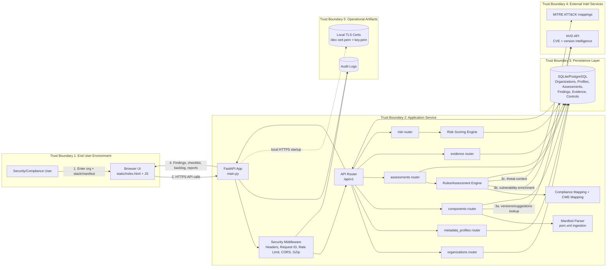

# Threat-Model Architecture Diagram

This diagram is designed for security review and threat modeling (DFD-style with trust boundaries).

## Full Solution Architecture (Threat Modeling View)



## STRIDE Threat Model (Per Diagram)

### Key Entry Points (from diagram)
- **TB1 → TB2:** Browser HTTPS API calls (label "2")
- **TB2 → TB3:** Data persistence (organizations, assessments, findings writes)
- **TB2 → TB4:** Outbound NVD/MITRE queries (labels "3a", "3b", "3c")
- **TB2 → TB5:** Audit logging + TLS cert loading
- **TB3 ← → TB2:** Assessment/finding reads and writes

### Sensitive Assets
- Organization metadata (TB1 → TB2 → TB3)
- Software stack + manifest content (R_META, R_COMP, MP in TB2)
- Assessment findings + evidence (R_ASSESS, R_EVID writes to TB3)
- Audit logs (TB5)
- API keys (request auth)
- NVD query results (TB4 ← TB2)

---

## 1. SPOOFING (Identity & Auth)

**Threat Actors:** Attackers claim to be legitimate users or internal services to bypass authentication.

### 1.1 API Caller Impersonation (TB1 → TB2 boundary)
**Attack:** Attacker sends requests without valid API key or forges authentication.

| Component | Current Risk | Mitigation |
|-----------|-------------|-----------|
| TB1 Browser sends HTTPS requests (label "2") | MEDIUM | HTTPS prevents tampering in transit |
| TB2 Middleware validates API keys | MEDIUM | Optional in dev; required in prod |
| All routers check `get_api_key_optional()` | MEDIUM | Config-driven; not database-backed |
| Rate limiting: 60 req/min per IP | **LOW** | Slows brute force |

**Recommended Hardening (⚠️ High):**
- Implement per-API-key rate limits (500 req/min per key)
- Move valid keys to database with versioning
- Hash stored keys; rotate every 30 days
- Log all auth attempts (success/failure)

---

### 1.2 Cross-Organization Access (TB2 ↔ TB3 boundary)
**Attack:** Attacker reads/modifies Organization A's assessments despite having no membership in Org A.

| Component | Current Risk | Mitigation |
|-----------|-------------|-----------|
| TB2 R_ORG routes accept `organization_id` as parameter | **CRITICAL** | No caller identity check; any org_id accepted |
| TB2 R_ASSESS, R_EVID filter by org_id | MEDIUM | SQL-level filtering works; but caller verification missing |
| TB3 Database has no row-level security (RLS) | **HIGH** | Database doesn't enforce org boundaries |
| No user authentication layer | **CRITICAL** | No way to associate caller with org membership |

**Recommended Hardening (⚠️ CRITICAL):**
- Implement user authentication (JWT or session tokens)
- Add `OrganizationMember` table with roles (admin, analyst, viewer)
- Verify caller's org membership before every org-scoped query:
```python
member = db.query(OrganizationMember).filter_by(
    organization_id=requested_org_id,
    user_id=current_user.id
).first()
if not member:
    raise 403 "Not authorized for this organization"
```
- Add database row-level security (PostgreSQL RLS) as defense-in-depth

---

## 2. TAMPERING (Integrity)

**Threat Actors:** Attackers modify data in flight, at rest, or during processing.

### 2.1 Manifest Input Tampering (TB1 → TB2, specifically MP - Manifest Parser)
**Attack:** Attacker modifies manifest content (pom.xml) to inject malicious component names or bypass filtering.

| Component | Current Risk | Mitigation |
|-----------|-------------|-----------|
| Browser uploads manifest to R_COMP router | MEDIUM | HTTPS protects transit |
| MP (Manifest Parser) in TB2 parses XML | **HIGH** | No content validation or checksums |
| No schema validation | **HIGH** | Accepts any well-formed XML |
| No integrity check stored | **HIGH** | Can't detect post-storage modifications |

**Recommended Hardening (⚠️ High):**
- Validate manifest content-type: `application/xml` or `text/xml` only
- Enforce manifest size limit: 5 MB max
- Store manifest SHA-256 hash in TB3 database
- Validate XML schema against whitelist of allowed elements
- Re-verify hash on retrieval to detect tampering

---

### 2.2 Finding/Evidence Modification (TB2 R_EVID ↔ TB3 boundary)
**Attack:** Attacker modifies assessments or findings after creation to hide vulnerabilities or cover tracks.

| Component | Current Risk | Mitigation |
|-----------|-------------|-----------|
| TB2 R_EVID PATCH endpoint allows updates | **HIGH** | Any authenticated caller can modify findings |
| TB3 Database stores findings in-place (no versions) | **HIGH** | No history of changes; modifications cover tracks |
| TB5 Audit logging captures action but not diffs | MEDIUM | Can't see what was changed |

**Recommended Hardening (⚠️ High):**
- Implement finding versioning (immutable storage):
  - Create new `FindingVersion` record on each update (don't modify original)
  - Mark old version as "superseded"
  - Store change summary + modifier identity
- Implement approval workflow for high-severity finding changes
- Require audit sign-off layer before findings marked "resolved"

---

### 2.3 NVD Cache Poisoning (TB2 ← → TB4 boundary)
**Attack:** Attacker intercepts or modifies NVD responses before caching in TB2.

| Component | Current Risk | Mitigation |
|-----------|-------------|-----------|
| TB2 caches NVD responses in-memory | **MEDIUM** | Cache not persisted; resets on restart |
| No HTTPS validation on NVD calls | **HIGH** | Could accept MITM responses |
| Cache keyed by component name | **MEDIUM** | Attacker learns what's cached |
| No cache entry signature | **HIGH** | Can't detect tampering if cache compromised |

**Recommended Hardening:**
- Validate NVD API certificate (TLS pinning for critical endpoints)
- Implement cache entry signing (HMAC over response data)
- Cache expiration: 24 hours (TTL)
- Monitor cache hit/miss ratio for anomalies

---

## 3. REPUDIATION (Accountability & Audit Trail)

**Threat Actors:** Attackers deny their actions or the system can't prove who did what.

### 3.1 Audit Log Gaps or Tampering (TB2 ↔ TB5 boundary)
**Attack:** Attacker performs action that goes unlogged, or deletes/modifies logs after the fact.

| Component | Current Risk | Mitigation |
|-----------|-------------|-----------|
| TB2 Middleware + all routers log to TB5 AUDIT | **LOW** | Good coverage of critical actions |
| Request IDs (from RequestIDMiddleware) enable correlation | **LOW** | Helps trace requests across logs |
| TB5 Audit logs stored in local file (audit.log) | **HIGH** | File system access can read/modify logs |
| No encryption on audit log file | **HIGH** | Plain-text content visible if compromised |
| No remote log shipping | **HIGH** | Logs not redundantly stored; single point of failure |

**Recommended Hardening (⚠️ High):**
- Ship logs to centralized SIEM immediately (Splunk, ELK, Datadog)
- Implement hash chain on audit records (each entry includes hash of previous)
- Encrypt audit logs at rest: AES-256-GCM
- Set file permissions: 600 (read-only to app user)
- Implement 90-day retention policy + archive older logs

---

### 3.2 Request Tracing Gaps (TB2 Middleware)
**Attack:** Attacker makes requests without identifiable correlation; audit log can't link events.

| Component | Current Risk | Mitigation |
|-----------|-------------|-----------|
| RequestIDMiddleware generates UUID per request | **LOW** | All requests traced |
| Request ID available to all route handlers | **LOW** | Included in logs |
| TB5 Audit logs include request ID | **LOW** | Full correlation chain present |

**Recommended Hardening:**
- Ensure request ID included in all structured log lines
- Continue propagating context for async tasks

---

## 4. INFORMATION DISCLOSURE (Confidentiality & Data Leakage)

**Threat Actors:** Attackers read data they shouldn't: org data, findings, metadata, audit logs, etc.

### 4.1 Cross-Organization Data Leakage (TB2 ↔ TB3 boundary)
**Attack:** Attacker reads findings, evidence, or profiles from other organizations.

| Component | Current Risk | Mitigation |
|-----------|-------------|-----------|
| TB2 routers filter queries by `organization_id` | MEDIUM | SQL filtering works if caller has legitimate org_id |
| TB3 Database has no row-level security | **HIGH** | DB doesn't enforce org boundaries |
| TB2 API routes accept `organization_id` parameter | **CRITICAL** | No verification caller can access that org (see Spoofing 1.2) |
| Audit logs capture org_id but not user identity | MEDIUM | Hard to attribute who accessed what |

**Recommended Hardening (⚠️ CRITICAL):**
- Implement user authentication + per-org membership checks (see Spoofing 1.2)
- Add database RLS: every query automatically filtered by `user_accessible_orgs`
- Implement per-role response filtering (admin sees all fields; analyst sees findings only; viewer sees read-only)

---

### 4.2 Error Message Information Leakage (TB2 Exception Handlers)
**Attack:** Attacker extracts system details (stack traces, schema info) from verbose error responses.

| Component | Current Risk | Mitigation |
|-----------|-------------|-----------|
| Production mode returns generic errors | **LOW** | Safe in production |
| Debug mode returns detailed errors | **LOW** | Only in development |
| Stack traces logged server-side, not returned | **LOW** | Good practice |
| Validation errors in dev expose schema hints | **MEDIUM** | Dev-only; low risk but worth hardening |

**Recommended Hardening:**
- Ensure `debug=false` and `APP_ENV=production` always in production
- Add startup check: warn if debug enabled in prod

---

### 4.3 NVD/MITRE Data Leakage (TB2 ↔ TB4 boundary)
**Attack:** Attacker learns what components/vulnerabilities are cached by timing analysis or unintended responses.

| Component | Current Risk | Mitigation |
|-----------|-------------|-----------|
| TB2 caches NVD responses in memory | **MEDIUM** | Cache keys leaked if process memory readable |
| Cache keyed by component name | **MEDIUM** | Attacker learns what's being assessed |
| No cache access control | **MEDIUM** | Any process thread can read cache |

**Recommended Hardening:**
- Encrypt sensitive cache entries (AES-256)
- Implement cache entry time-to-live (TTL): 24 hours
- Monitor cache usage for anomalies
- Don't expose cache stats in debug endpoints

---

### 4.4 Audit Log Exposure (TB5 Storage)
**Attack:** Attacker reads audit logs to learn about other orgs' vulnerabilities or activities.

| Component | Current Risk | Mitigation |
|-----------|-------------|-----------|
| TB5 Audit logs stored in local file | **HIGH** | File system access can read logs |
| No access control on audit.log | **HIGH** | Process owner + others can read |
| No encryption | **HIGH** | Plain-text if store accessed |
| Logs not archived securely | **HIGH** | No separation between current + historical logs |

**Recommended Hardening (⚠️ High):**
- Encrypt logs at rest: AES-256-GCM
- Ship to remote SIEM immediately
- Set file permissions: 600 (read-only to app user)
- Implement retention: 90 days current + archived securely
- Separate audit database credentials from app credentials

---

## 5. DENIAL OF SERVICE (Availability)

**Threat Actors:** Attackers make the system unavailable through resource exhaustion or dependency failures.

### 5.1 Rate Limit Bypass (TB2 Middleware)
**Attack:** Attacker circumvents rate limits to perform brute force, resource exhaustion, or scanning.

| Component | Current Risk | Mitigation |
|-----------|-------------|-----------|
| Global rate limit: 60 req/min per IP (Middleware) | **MEDIUM** | In-memory; resets on restart |
| No per-endpoint customization | **MEDIUM** | R_ASSESS expensive; R_COMP cheap (same limit) |
| No per-API-key limits | **HIGH** | Only IP-based; VPN users share limits |
| No adaptive rate limiting | **MEDIUM** | No escalation on repeated violations |

**Recommended Hardening (⚠️ High):**
- Switch to Redis-backed rate limiting (survives restarts)
- Implement per-endpoint limits:
  - R_COMP (cheap): 300/min
  - R_ASSESS (expensive): 5/min
  - R_ORG (moderate): 100/min
- Add per-API-key limits: 500/min
- Implement adaptive rate limiting: tighter on repeated 429 responses

---

### 5.2 NVD API Dependency Failure (TB2 ↔ TB4 boundary)
**Attack:** NVD becomes unavailable; system can't fetch vulnerabilities, blocking assessments.

| Component | Current Risk | Mitigation |
|-----------|-------------|-----------|
| TB2 Component/Assessment routers call NVD directly | **CRITICAL** | Single point of failure; blocking request |
| No timeout on NVD requests | **HIGH** | Slow/hanging request blocks entire API worker |
| No cached fallback data | **HIGH** | No vulnerabilities returned if NVD down |
| No circuit breaker pattern | **HIGH** | Cascading failures on repeated NVD outages |

**Recommended Hardening (⚠️ High):**
- Implement request timeout: 5 seconds for NVD calls
- Cache NVD responses with TTL: 24 hours
- Implement circuit breaker:
  - After 5 failed NVD calls in 1 minute → return cached data
  - Prevent cascading failures
- Return response: "Vulnerability data temporarily unavailable; using cached data"

---

### 5.3 Expensive Assessment Computation (TB2 R_ASSESS ↔ RE engine)
**Attack:** Attacker triggers expensive correlation + risk scoring repeatedly, consuming CPU.

| Component | Current Risk | Mitigation |
|-----------|-------------|-----------|
| TB2 R_ASSESS synchronously runs RE (Rules Engine) + CE + RS | **MEDIUM** | Expensive computation; ties up worker |
| No job queue or async processing | **HIGH** | Blocking request; no horizontal scaling |
| No result caching | **HIGH** | Same assessment run twice = wasted work |
| No timeout on engine execution | **HIGH** | Runaway computation can hang worker indefinitely |

**Recommended Hardening (⚠️ High):**
- Implement async job queue (Celery + Redis):
  - POST `/assessments` returns job_id immediately (202 Accepted)
  - Client polls GET `/assessments/{job_id}` for status/results
  - Job runs in background worker
- Cache assessment results: 1 hour (if metadata unchanged)
- Add timeout to correlation engine: 30 seconds max
- Implement job priorities (user-initiated = high; batch = low)

---

### 5.4 Large Manifest Parsing (TB1 → TB2 MP component)
**Attack:** Attacker uploads huge manifest (10+ MB pom.xml) to exhaust memory/CPU.

| Component | Current Risk | Mitigation |
|-----------|-------------|-----------|
| TB1 Browser uploads manifest to TB2 R_COMP | **MEDIUM** | No size limit enforced |
| TB2 MP (Manifest Parser) parses entire file into memory | **HIGH** | Large files = memory spike + slow parse |
| No streaming parser (loads all into memory) | **HIGH** | DoS via memory exhaustion |
| No parsing timeout | **MEDIUM** | Runaway parser can hang worker |

**Recommended Hardening:**
- Enforce manifest size limit: 5 MB max
- Return 413 Payload Too Large if exceeded
- Implement streaming XML parser (lxml iterparse)
- Add parsing timeout: 10 seconds

---

### 5.5 Database Connection Exhaustion (TB2 ↔ TB3 boundary)
**Attack:** Attacker opens many concurrent requests, exhausting DB connection pool.

| Component | Current Risk | Mitigation |
|-----------|-------------|-----------|
| SQLAlchemy connection pool (default: 10 connections) | **MEDIUM** | Small pool; easy to exhaust |
| No connection pool monitoring | **HIGH** | No visibility into pool usage |
| DB queries may run long (TB2 correlation engine) | **MEDIUM** | Holds connection while processing |

**Recommended Hardening:**
- Configure pool with overflow: `pool_size=20, max_overflow=40` (total 60)
- Add connection pool monitoring: log checkedout; alert > 80% utilized
- Implement per-query timeout: 30 seconds
- Current `pool_pre_ping=True` helps (already enabled)

---

## 6. ELEVATION OF PRIVILEGE (Authorization & Access Control)

**Threat Actors:** Attackers gain access or permissions they shouldn't have.

### 6.1 Organization Access Bypass (TB2 ↔ TB3, all routers)
**Attack:** Attacker accesses Organization A's assessments despite no membership in Org A.

| Component | Current Risk | Mitigation |
|-----------|-------------|-----------|
| TB2 routers (R_ORG, R_ASSESS, R_EVID) accept org_id parameter | **CRITICAL** | No verification caller can access org |
| No user authentication layer | **CRITICAL** | Can't associate caller with org membership |
| TB3 Database has no RLS | **CRITICAL** | DB doesn't enforce boundaries |

**Recommended Hardening (⚠️ CRITICAL):**
- See **Spoofing 1.2** and **Information Disclosure 4.1** for full mitigation

---

### 6.2 API Key Privilege Escalation (TB1 → TB2, all routes)
**Attack:** Attacker uses API key to modify/delete data despite having only read access.

| Component | Current Risk | Mitigation |
|-----------|-------------|-----------|
| All API keys equivalent; same access level | **HIGH** | No fine-grained permissions |
| No key scoping (read-only, write, admin) | **HIGH** | Key compromise = full access |
| No per-org key binding | **HIGH** | Single key accesses all orgs |
| DELETE endpoints not restricted | **HIGH** | Dangerous operations allowed freely |

**Recommended Hardening (⚠️ High):**
- Implement API key scopes:
  - `read`: GET only
  - `write`: GET + POST + PATCH
  - `admin`: GET + POST + PATCH + DELETE (rare)
- Implement per-org key binding:
  - Key can only access Organization X
  - Requesting Org Y → 403 "Key not authorized"
- Implement key expiration + auto-rotation

---

### 6.3 Middleware Bypass (TB2 Middleware stack)
**Attack:** Attacker bypasses security headers, rate limiting, or request tracking.

| Component | Current Risk | Mitigation |
|-----------|-------------|-----------|
| Middleware stack properly layered (SecurityHeaders → RequestID → ResponseTime) | **LOW** | Good architecture |
| CORS allows all origins `["*"]` in dev | **MEDIUM** | Production must whitelist |
| All routes go through middleware | **LOW** | No bypass paths |

**Recommended Hardening:**
- Ensure `CORS_ORIGINS` explicitly set in production (whitelist)
- Add startup validation: verify middleware applied to all routes
- Test middleware enforcement with security scanning

---

## Summary: Prioritized Mitigations

| Priority | Threat | Mitigation | Trust Boundary |
|----------|--------|-----------|-----------------|
| **CRITICAL** | Spoofing 1.2, Elevation 6.1 | User auth + org membership checks | TB1 ↔ TB2 ↔ TB3 |
| **CRITICAL** | Information Disclosure 4.1 | Row-level security + caller auth | TB2 ↔ TB3 |
| ⚠️ **HIGH** | Tampering 2.2 | Finding audit trail + versioning | TB2 ↔ TB3 |
| ⚠️ **HIGH** | Repudiation 3.1 | SIEM + log encryption + hash chain | TB2 ↔ TB5 |
| ⚠️ **HIGH** | DoS 5.1 | Redis rate limiting + per-endpoint tuning | TB2 Middleware |
| ⚠️ **HIGH** | DoS 5.2 | NVD circuit breaker + caching + timeout | TB2 ↔ TB4 |
| ⚠️ **HIGH** | DoS 5.3 | Async job queue (Celery) | TB2 R_ASSESS |
| ⚠️ **HIGH** | Elevation 6.2 | API key scopes + per-org binding | TB1 → TB2 |

---

## Threat Model Review Cadence

- **Monthly:** Review critical/high-priority mitigations for completeness
- **Quarterly:** Full threat model refresh (new features, architecture changes)
- **Post-Incident:** Immediate update if any issue exploits a gap

## Detailed DFD: Assessment Execution Workflow

Use this when you want to threat model a single high-value path in depth.

```mermaid
flowchart TD
    %% External Actor
    A[Analyst/User]

    %% Trust Boundary: Browser
    subgraph B1[Boundary: Browser]
        UI[Web UI\nCollect org + stack]
    end

    %% Trust Boundary: API Service
    subgraph B2[Boundary: FastAPI Service]
        EP1[POST /organizations]
        EP2[POST /metadata-profiles]
        EP3[POST /assessments]
        EP4[POST analyze-nvd]
        EP5[GET findings]

        VAL[Validation + auth/rate-limit middleware]
        RULES[Rules engine + control mapping]
        CORR[Correlation logic\ncomponent version to CVE/CWE/control]
        SCORE[Risk prioritization\n(priority window/severity)]
        AUD[Audit logger]
    end

    %% Trust Boundary: Data Store
    subgraph B3[Boundary: Database]
        ORGT[(Organizations)]
        PROFT[(MetadataProfiles)]
        ASST[(Assessments)]
        FINDT[(Findings)]
        CTRLT[(Controls)]
    end

    %% Trust Boundary: External Intel
    subgraph B4[Boundary: External Threat Intel]
        NVD2[NVD API]
        MITRE2[MITRE mapping data]
    end

    %% User flow
    A --> UI
    UI --> EP1
    UI --> EP2
    UI --> EP3
    UI --> EP4
    UI --> EP5

    %% API internals
    EP1 --> VAL
    EP2 --> VAL
    EP3 --> VAL
    EP4 --> VAL
    EP5 --> VAL

    VAL --> ORGT
    VAL --> PROFT
    VAL --> ASST

    EP4 --> RULES
    RULES --> CTRLT
    EP4 --> CORR
    CORR --> NVD2
    CORR --> MITRE2
    CORR --> SCORE
    SCORE --> FINDT
    SCORE --> ASST

    %% Audit everywhere
    EP1 --> AUD
    EP2 --> AUD
    EP3 --> AUD
    EP4 --> AUD
    EP5 --> AUD

    %% Response
    FINDT --> EP5
    EP5 --> UI
```

### Threat-Model Prompts for This DFD

- Input validation: How is malformed stack/manifest input rejected before correlation logic?
- External dependency trust: What happens if NVD is unavailable or returns partial data?
- Authorization scope: Can one org read another org's assessments/findings?
- Integrity: How do we prevent tampering of assessment/finding records between creation and display?
- DoS controls: Which endpoints are rate-limited and where are expensive calls cached?
